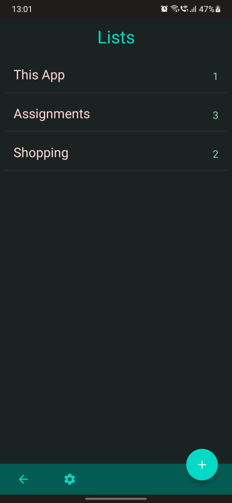
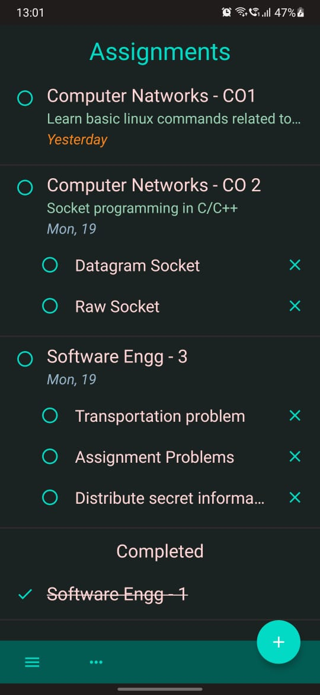
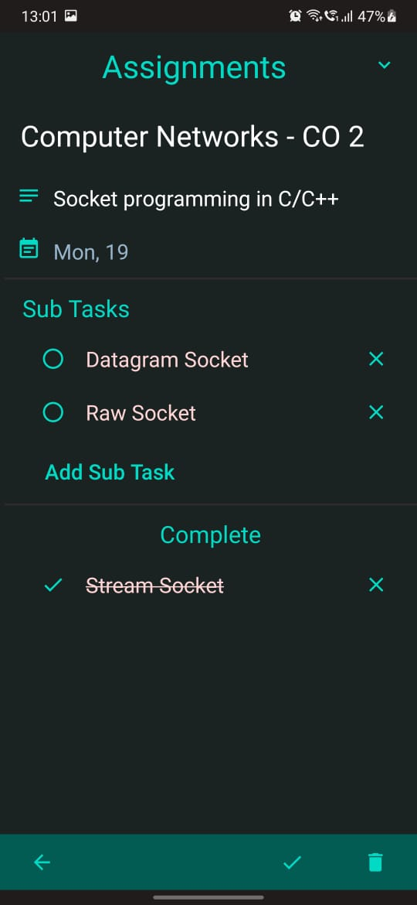
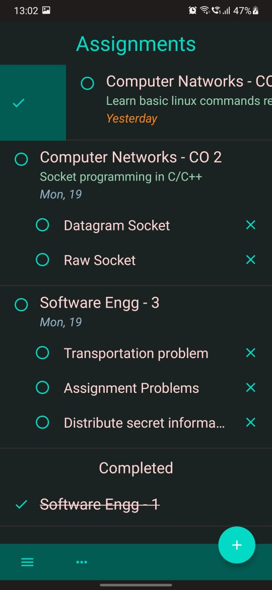
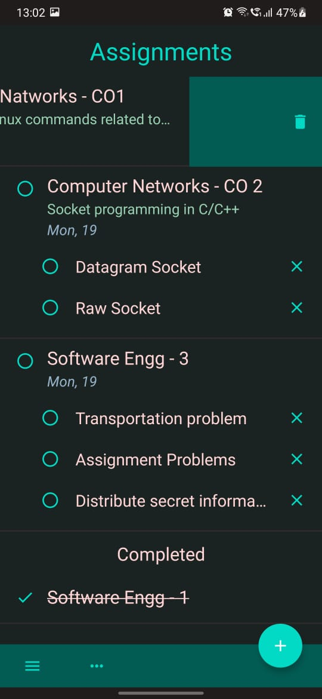

# Tasks - A ToDo List Android App

## Few features of this app:

### 1. Can maintain multiple lists

--- 

### 2. Each Task can contain Sub-Tasks, Details and Due Date 

---

### 3. Detailed view of any Task

---

### 4. Supports gestures like swipe right to complete, swipe left to delete and drag to change order (if custom ordering is selected).

_

_

